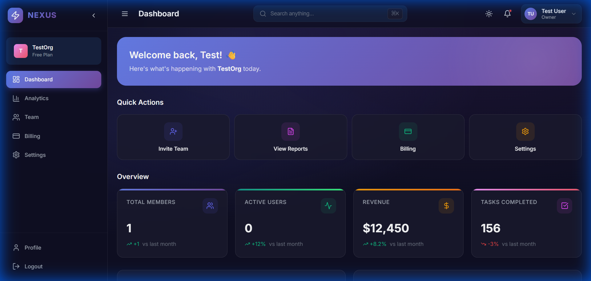
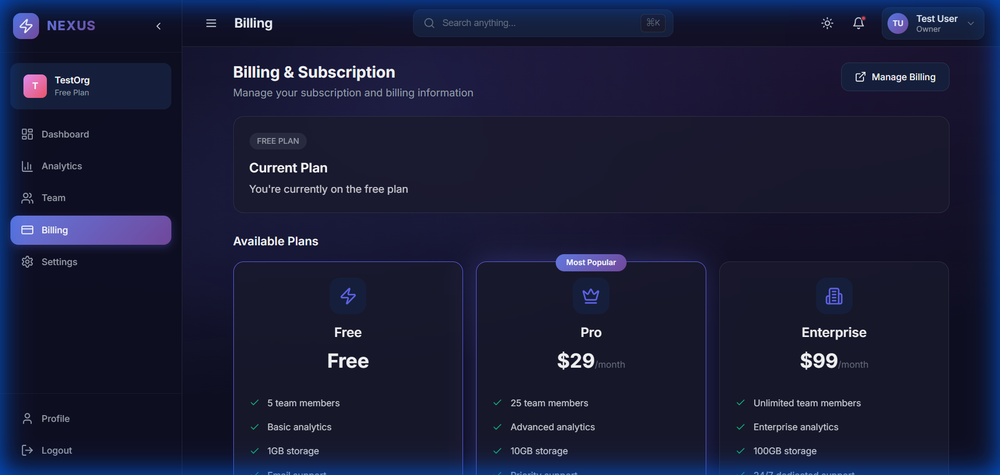

# 🚀 Nexus - Modern SaaS Dashboard

<div align="center">


[](https://reactjs.org/)
[](https://nodejs.org/)
[](https://www.mongodb.com/)
[](https://stripe.com/)

**A beautiful, full-featured multi-tenant SaaS dashboard with authentication, team management, billing, and analytics.**

[Live Demo](#) • [Documentation](#features) • [Getting Started](#-quick-start)

</div>

---

## ✨ Features

### 🔐 Authentication & Security
- **Secure Login/Register** with JWT tokens
- **Email Verification** system
- **Password Reset** functionality
- **Rate Limiting** protection
- **Helmet.js** security headers

### 👥 Multi-Tenant Architecture
- **Organization-based** team management
- **Role-based access control** (Owner, Admin, Member)
- **Team member invitations**
- **Activity logging** for audit trails

### 💳 Stripe Billing Integration
- **Subscription management** (Free, Pro, Enterprise)
- **Stripe Checkout** for secure payments
- **Customer Portal** for self-service billing
- **Webhook handling** for real-time updates

### 📊 Dashboard & Analytics
- **Beautiful dark theme** with glassmorphism effects
- **Interactive charts** with Recharts
- **Real-time statistics**
- **Activity feed** tracking
- **Quick action shortcuts**

### ⚙️ Settings & Profile
- **User profile management**
- **Organization settings**
- **Theme customization** (Dark/Light mode)

---

## 🖼️ Screenshots

<div align="center">
<table>
<tr>
<td></td>
<td></td>
</tr>
<tr>
<td align="center"><b>Dashboard Overview</b></td>
<td align="center"><b>Billing & Plans</b></td>
</tr>
</table>
</div>

---

## 🛠️ Tech Stack

| Category | Technologies |
|----------|-------------|
| **Frontend** | React 18, React Router, Zustand, Recharts, Axios |
| **Backend** | Node.js, Express.js, MongoDB, Mongoose |
| **Authentication** | JWT, bcryptjs |
| **Payments** | Stripe Checkout, Customer Portal, Webhooks |
| **Styling** | CSS3, CSS Variables, Glassmorphism |
| **Security** | Helmet, CORS, Rate Limiting, Input Validation (Joi) |

---

## 🚀 Quick Start

### Prerequisites

- Node.js 20+ 
- MongoDB Atlas account (or local MongoDB)
- Stripe account (for billing features)

### 1️⃣ Clone the Repository

```bash
git clone https://github.com/Aakash-cpu/nexus-saas-dashboard.git
cd nexus-saas-dashboard
```

### 2️⃣ Install Dependencies

```bash
# Install backend dependencies
cd backend
npm install

# Install frontend dependencies
cd ../frontend
npm install
```

### 3️⃣ Configure Environment Variables

Create a `.env` file in the `backend` directory:

```env
# Server
PORT=5000
NODE_ENV=development

# MongoDB
MONGODB_URI=mongodb+srv://your-connection-string

# JWT Secrets
JWT_SECRET=your-super-secret-jwt-key
JWT_REFRESH_SECRET=your-super-secret-refresh-key

# Email (optional)
SMTP_HOST=smtp.gmail.com
SMTP_PORT=587
SMTP_USER=your-email@gmail.com
SMTP_PASS=your-app-password

# Stripe
STRIPE_SECRET_KEY=sk_test_your_key
STRIPE_PRICE_PRO=price_your_pro_price_id
STRIPE_PRICE_ENTERPRISE=price_your_enterprise_price_id

# Frontend URL
FRONTEND_URL=http://localhost:3000
```

### 4️⃣ Run the Application

```bash
# Terminal 1 - Backend
cd backend
npm run dev

# Terminal 2 - Frontend
cd frontend
npm run dev
```

Visit `http://localhost:3000` 🎉

---

## 📁 Project Structure

```
nexus-saas-dashboard/
├── frontend/                 # React frontend
│   ├── public/
│   ├── src/
│   │   ├── components/      # Reusable components
│   │   ├── pages/           # Page components
│   │   ├── services/        # API services
│   │   ├── stores/          # Zustand stores
│   │   ├── layouts/         # Layout components
│   │   └── styles/          # Global styles
│   └── package.json
│
├── backend/                  # Node.js backend
│   ├── src/
│   │   ├── config/          # Database, Stripe config
│   │   ├── controllers/     # Route controllers
│   │   ├── middleware/      # Auth, error handling
│   │   ├── models/          # Mongoose models
│   │   ├── routes/          # API routes
│   │   ├── services/        # Business logic
│   │   └── app.js           # Express app
│   └── package.json
│
└── README.md
```

---

## 🔌 API Endpoints

### Authentication
| Method | Endpoint | Description |
|--------|----------|-------------|
| POST | `/api/auth/register` | Register new user |
| POST | `/api/auth/login` | User login |
| POST | `/api/auth/logout` | User logout |
| POST | `/api/auth/forgot-password` | Request password reset |
| POST | `/api/auth/reset-password` | Reset password |
| GET | `/api/auth/verify-email/:token` | Verify email |

### Billing
| Method | Endpoint | Description |
|--------|----------|-------------|
| GET | `/api/billing/plans` | Get available plans |
| GET | `/api/billing/subscription` | Get current subscription |
| POST | `/api/billing/checkout` | Create checkout session |
| POST | `/api/billing/portal` | Create customer portal |

### Organization
| Method | Endpoint | Description |
|--------|----------|-------------|
| GET | `/api/organization` | Get organization details |
| PUT | `/api/organization` | Update organization |
| GET | `/api/organization/members` | Get team members |
| POST | `/api/organization/invite` | Invite team member |

---

## 🎨 Design System

The dashboard uses a custom CSS design system with:

- **CSS Variables** for theming
- **Dark/Light mode** support
- **Glassmorphism** effects
- **Smooth animations**
- **Responsive design**

---

## 🤝 Contributing

Contributions are welcome! Please feel free to submit a Pull Request.

1. Fork the repository
2. Create your feature branch (`git checkout -b feature/AmazingFeature`)
3. Commit your changes (`git commit -m 'Add some AmazingFeature'`)
4. Push to the branch (`git push origin feature/AmazingFeature`)
5. Open a Pull Request

---

## 📄 License

This project is licensed under the MIT License - see the [LICENSE](LICENSE) file for details.

---

## 👨‍💻 Author

**Aakash Sarkar**
- Email: aakashsarkar269@gmail.com
- GitHub: [@Aakash-cpu](https://github.com/Aakash-cpu)

---

<div align="center">

**⭐ Star this repo if you found it helpful!**

Made with ❤️ using React & Node.js

</div>
